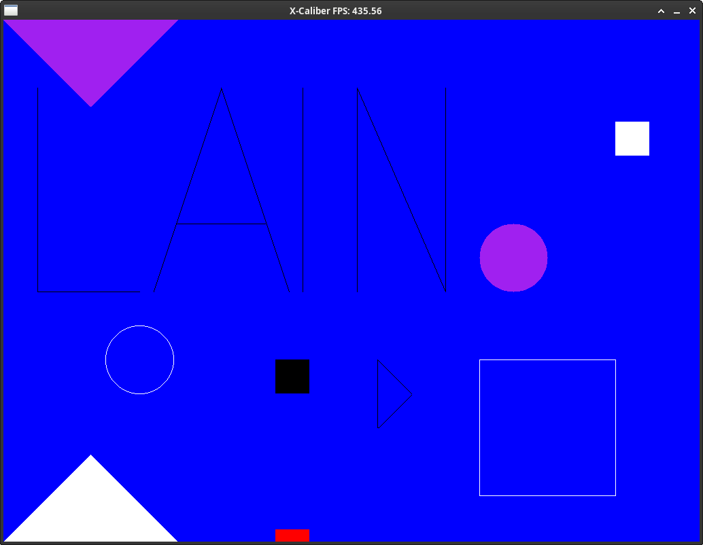

# xcaliber

Game inspired by XCaliber from TempleOS.

# Dependencies

- SDL3

# Why C

- To force myself to simplify as much as possible.
- To better understand what my computer is doing.
- To implement as much as I can by myself and learn.

# Philosophy

- KISS: aim for simplicity in design and implementation.
- Clean naming (very hard): descriptive and concise.
- Minimalism: avoid unnecessary complexity. Not needed? don't include it.
- Modularity: break into modules, as independent as possible.
- Clean interfaces (.h files).
- Fail fast and provide informative error messages.
- Avoid using malloc/free within a game's frame. Use memory pools.
- Consistent code style. Try to emulate OpenBSD's.
- Comments explain why, not what.
- Optimise for clarity first, then if needed for performance.

# Current Screenshot

# Resources

- https://github.com/xuwd1/rdtsc-notes
- https://youtu.be/CceepU1vIKo (bresenham's)
- https://en.wikipedia.org/wiki/Bresenham%27s_line_algorithm
- https://en.wikipedia.org/wiki/Midpoint_circle_algorithm
- https://youtu.be/sre081cGKV8 (drawing triangle primitives filled)
- https://en.wikipedia.org/wiki/Scanline_rendering
- https://nerdparadise.com/math/pointinatriangle
- https://web.archive.org/web/20210208132927/http://assemblyrequired.crashworks.org/timing-square-root/
- https://solhsa.com/tri/index.html (optimised triangle rasteriser)
- https://youtu.be/k5wtuKWmV48
- https://gabrielgambetta.com/computer-graphics-from-scratch/07-filled-triangles.html
- https://fgiesen.wordpress.com/2013/02/06/the-barycentric-conspirac/
- https://github.com/FFmpeg/asm-lessons/blob/main/lesson_01/index.md

# Conventions

- Triangles are defined counter-clockwise. One of the places where this is applied is determining if one point is inside a triangle or not.

# Tasks

- X Use arenas (pool, stack, linear). Try to build the game with only those.
- X Use SDL3, not 2.
- X Render a black red window from scratch. (using my own framebuffer)
- X Study what you just did. Write about it on your website.
- X Refactor a bit before doing hot reloading.
- X Prepare hot reloading code. Investigate how it works, that is to say, if I save a file, is there a way for files to recompile automatically and see changes instantly?
- X Study what you just did. Write about it on your website.
- X Is there a problem in relying on VSYNC? Investigate. If yes, try to handle the time spent in a frame manually.
  - Frame skipping: when VSync is enabled and I miss a refresh window (1/60 or 1/144 or 1/240), I have to wait for the next refresh cycle. VSync works with complete frames, not partial ones. FPS drop.
  - When a window is missed, the monitor shows the previous frame again.
  - Say I have a piece of code that is using a fixed time step of 1/60:
    - If I use a monitor of 30Hz and I have VSync enabled:
      - Each update would move entities by velocity * 1/60
      - But I'm updating at 1/30, 30Hz
      - So the game would be processed at half speed
    - If I have uncapped framerate (no VSync):
      - If FPS are 120, I'm processing 120 frames per second, but the update is still using 1/60 at the timestep!
      - So the game would be running at 2x speed
    - Frame drops (and VSync enabled):
      - Suppose the game frame takes 32ms instead of 16.67ms.
      - I still use 1/60 as the timestep
      - But, in this case, I'm updating less frequently!
      - The result would be jerky motion AND!!! incorrect physics!
- X Implement a hybrid approach (for now):
  - Fixed timestep physics/logic loop: ensure they remain consistent regardless of frame rate.
  - Keep VSync enabled initially, it helps with tearing and power consumption (who cares about this one, lol).
  - Add a flag/func to toggle VSync.
  - Create a function to keep monitor performance, show a message somewhere if it's running slow.
- X Try some SIMD/ASM to draw colours.
- X Use a fixed time step for physics, not variable. Render as fast as possible, but interpolate.
- X Draw primitives.
- X Refactor, add point structs to simplify function calls.
- X Refactor, create a renderer module with a decent API.
- X Add bound checking to framebuffer somehow.
- X "Flood fill". More like filled primitives.
- X Parametrise AVX2 / SSE / SSE2. Only AVX2.
- X Create vector data types to improve readability.
- X Improve triangle rasteriser.
- X Add colours per vertex and interpolation
- X Optimise it with SIMD
- X Test case with triangles that share edges.
- X Change code to handle share edge case.
- X Can Heron's formula be used instead?
- X Transformations (rotation, scale, translation)
- Use commands instead of different shapes and functions and stuff. A command is basically a data structure that contains all the information
  the renderer needs in order to draw something. It's useful for batching as well

- Abstract coordinate systems: right now I'm specifying every position with pixel values, but that's problematic. When the game world is created, I need to specify positions with floating point values. To handle physics and a myriad of other things this is also useful
- Clipping for all primitives: once I have the camera and world coordinates, start with clipping stuff that won't be seen by the player so that I save computational power
- Game objects need to be passed somehow to the game logic module
- Add support for textures: textured triangles, quads or circles
- Particle systems: some visual effects like thrusters and explosions are good; particles that fade over time, small points or quads...
- Batch draw calls or something... I think drawing triangles individually isn't very good
- Spaceship controls, shooting, projectile spawning
- Collision detection
- Enemy AI
- Health system, scoring and game states

# Annotations

- SPEED
- XXX
- FIXME
- TODO
